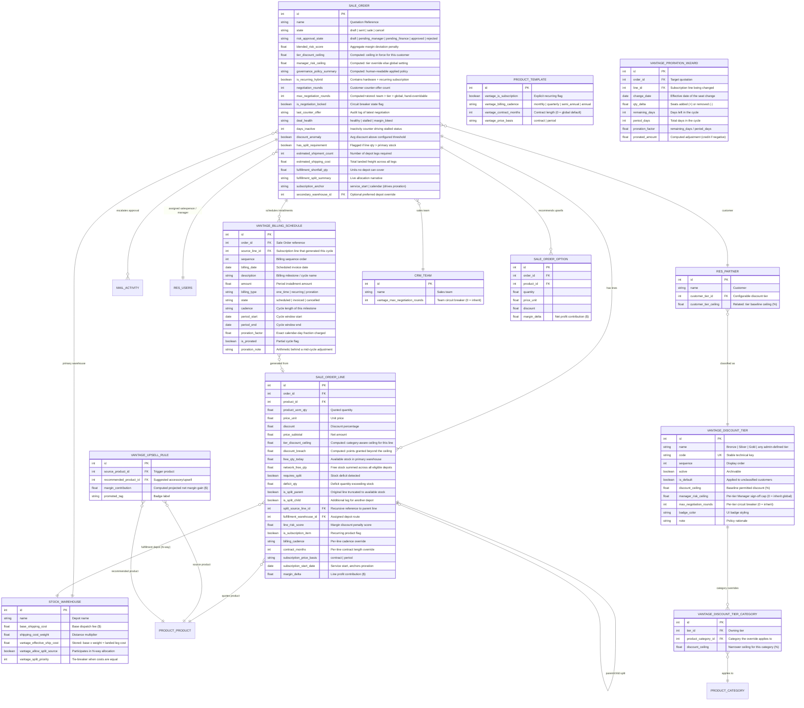

# 📊 VantageOps Data Schema & Entity Relationship Architecture

This document specifies the complete **Database Schema**, **Data Dictionary**, **Entity Relationship Model**, and **Security Access Rights** for the VantageOps application suite on Odoo.

---

## 1. Entity Relationship Model (ERD)

> **Policy resolution note.** Every commercial threshold is a record or a system parameter,
> never a Python literal. Values resolve through the `vantage.config` accessor
> (`ir.config_parameter` keys namespaced `vantage.*`) with a shipped default as fallback.
> Precedence for a discount ceiling is: tier ▸ product-category override → tier baseline →
> `vantage.default_discount_ceiling`. For negotiation rounds it is: sales team → customer
> tier → `vantage.default_max_negotiation_rounds`.

---

## 2. Core Data Dictionary

### Model: `vantage.discount.tier` (New Model: `_name = 'vantage.discount.tier'`)

The configurable replacement for what used to be a hardcoded Python dict of tier ceilings.
Administrators may define any number of tiers (Platinum, Distributor, Government, …).

| Field Name | Type | Properties | Description | Module |
| :--- | :--- | :--- | :--- | :--- |
| `name` | `Char` | `required=True`, `translate=True` | Display name of the tier. | `vantage_governance` |
| `code` | `Char` | `required=True`, `UNIQUE` | Stable technical key used by data files, imports and migrations. | `vantage_governance` |
| `sequence` | `Integer` | `default=10` | Ordering in the configuration list. | `vantage_governance` |
| `active` | `Boolean` | `default=True` | Archive flag. | `vantage_governance` |
| `is_default` | `Boolean` | constrained to a single active record | Tier applied to new/unclassified customers. | `vantage_governance` |
| `discount_ceiling` | `Float` | `required=True`, `0 <= x <= 100` | Baseline discount a rep may grant before the approval workflow triggers. | `vantage_governance` |
| `manager_risk_ceiling` | `Float` | `default=0.0` | Per-tier Manager sign-off cap. `0` inherits `vantage.manager_risk_ceiling`. | `vantage_governance` |
| `max_negotiation_rounds` | `Integer` | `default=0` | Per-tier circuit breaker budget. `0` inherits the global setting. | `vantage_governance` |
| `badge_color` | `Selection` | `muted/info/primary/success/warning/danger` | UI badge styling. | `vantage_governance` |
| `category_ceiling_ids` | `One2many` | → `vantage.discount.tier.category` | Narrower ceilings for specific product categories. | `vantage_governance` |
| `partner_count` | `Integer` | `compute='_compute_partner_count'` | Number of customers classified in this tier. | `vantage_governance` |

**Key method** — `get_ceiling_for_product(product)`: returns the applicable ceiling, walking
**up the product category tree** so an override on *Services* also covers
*Services / Professional Services* unless that child defines its own.

---

### Model: `vantage.discount.tier.category` (New Model)

| Field Name | Type | Properties | Description | Module |
| :--- | :--- | :--- | :--- | :--- |
| `tier_id` | `Many2one` | `required=True`, `ondelete='cascade'`, indexed | Owning tier. | `vantage_governance` |
| `product_category_id` | `Many2one` | `comodel_name='product.category'`, `required=True` | Category the override applies to. | `vantage_governance` |
| `discount_ceiling` | `Float` | `required=True`, `0 <= x <= 100` | Ceiling for this category (e.g. Gold 15% overall, 8% on Services). | `vantage_governance` |

*Constraint*: `UNIQUE(tier_id, product_category_id)`.

---

### Model: `res.partner` (Inherited)

| Field Name | Type | Properties | Description | Module |
| :--- | :--- | :--- | :--- | :--- |
| `customer_tier_id` | `Many2one` | → `vantage.discount.tier`, `tracking=True`, `ondelete='restrict'` | Commercial classification driving the discount ceiling. Replaces the former `customer_tier` Selection; a migration carried legacy values across. | `vantage_governance` |
| `customer_tier_ceiling` | `Float` | `related='customer_tier_id.discount_ceiling'`, `readonly=True` | Convenience readout of the tier baseline. | `vantage_governance` |

---

### Model: `sale.order` (Inherited from `sale.order`)

| Field Name | Type | Properties | Description | Module |
| :--- | :--- | :--- | :--- | :--- |
| `blended_risk_score` | `Float` | `compute='_compute_vantage_risk'`, `store=True` | Weighted risk score. Each line is measured against the ceiling of **its own product category**; only the excess beyond the ceiling is penalised. | `vantage_core` |
| `risk_approval_state` | `Selection` | `['draft','pending_approval','pending_manager','pending_finance','approved','rejected']` | State machine tracking commercial approval status. | `vantage_core` / `vantage_governance` |
| `is_recurring_hybrid` | `Boolean` | `compute`, `store=True` | True if quote contains both one-time and recurring subscription lines. | `vantage_core` |
| `tier_discount_ceiling` | `Float` | `compute='_compute_governance_policy'` | Baseline ceiling in force for this customer. | `vantage_governance` |
| `manager_risk_ceiling` | `Float` | `compute='_compute_governance_policy'` | Escalation boundary: tier override else `vantage.manager_risk_ceiling`. | `vantage_governance` |
| `governance_policy_summary` | `Char` | `compute='_compute_governance_policy'` | Human-readable statement of the applied policy, shown on the form. | `vantage_governance` |
| `negotiation_rounds` | `Integer` | `default=0`, `readonly=True` | Counter-offers submitted so far. | `vantage_governance` |
| `max_negotiation_rounds` | `Integer` | `compute`, `store=True`, `readonly=False` | Circuit breaker budget resolved **team → tier → global**, still hand-overridable per quotation. | `vantage_governance` |
| `is_negotiation_locked` | `Boolean` | `compute`, `store=True` | True when `negotiation_rounds >= max_negotiation_rounds`. | `vantage_governance` |
| `last_counter_offer` | `Char` | `readonly=True` | Summary of the last counter-offer. | `vantage_governance` |
| `deal_health` | `Selection` | `['healthy','stalled','margin_bleed']`, `compute`, `store=True` | Driven by configurable thresholds, not fixed numbers. | `vantage_governance` |
| `days_inactive` | `Integer` | `compute`, `store=True` | Inactivity counter compared against `vantage.stalled_days`. | `vantage_governance` |
| `discount_anomaly` | `Boolean` | `compute`, `store=True` | Average discount ≥ `vantage.discount_anomaly_threshold`. | `vantage_governance` |
| `has_split_requirement` | `Boolean` | `compute`, `store=True` | Any line has an inventory deficit against primary warehouse stock. | `vantage_fulfillment` |
| `estimated_shipment_count` | `Integer` | `compute`, `store=True` | Number of depot legs required (now **N**, not capped at 2). | `vantage_fulfillment` |
| `estimated_shipping_cost` | `Float` | `compute`, `store=True` | Sum of landed leg costs across all depots used. | `vantage_fulfillment` |
| `fulfillment_shortfall_qty` | `Float` | `compute`, `store=True` | Units no configured depot can cover; surfaced rather than silently dropped. | `vantage_fulfillment` |
| `fulfillment_split_summary` | `Text` | `compute`, `store=True` | Live narrative of the allocation plan. | `vantage_fulfillment` |
| `fulfillment_plan_html` | `Html` | `compute`, `sanitize=False` | Leg-by-leg allocation table rendered on the quotation. | `vantage_fulfillment` |
| `subscription_anchor` | `Selection` | `['service_start','calendar']` | Anniversary vs calendar-aligned cycles. Calendar alignment is what produces prorated partial cycles. | `vantage_fulfillment` |
| `secondary_warehouse_id` | `Many2one` | `comodel_name='stock.warehouse'` | Optional override forcing one depot to the front of the ranking. Retained for backwards compatibility. | `vantage_fulfillment` |
| `billing_schedule_ids` | `One2many` | → `vantage.billing.schedule` | Milestone and recurring invoice schedules. | `vantage_fulfillment` |
| `billing_schedule_count`| `Integer` | `compute` | Display counter badge. | `vantage_fulfillment` |

---

### Model: `sale.order.line` (Inherited from `sale.order.line`)

| Field Name | Type | Properties | Description | Module |
| :--- | :--- | :--- | :--- | :--- |
| `line_risk_score` | `Float` | `compute='_compute_line_risk_score'`, `store=True` | Individual line penalty based on discount vs product category target margin. | `vantage_core` |
| `is_subscription_item` | `Boolean` | `compute='_compute_is_subscription_item'`, `store=True` | Flags whether product is categorized as a recurring subscription service. | `vantage_core` |
| `free_qty_today` | `Float` | `compute='_compute_free_qty_today'` | Live real-time unreserved quantity in order's primary warehouse. | `vantage_fulfillment` |
| `requires_split` | `Boolean` | `compute='_compute_requires_split'`, `store=True` | Flagged True when `product_uom_qty > free_qty_today`. | `vantage_fulfillment` |
| `deficit_qty` | `Float` | `compute='_compute_deficit_qty'`, `store=True` | The stock shortfall amount (`product_uom_qty - free_qty_today`). | `vantage_fulfillment` |
| `is_split_parent` | `Boolean` | `default=False` | True if this line was truncated to available stock during auto-split. | `vantage_fulfillment` |
| `is_split_child` | `Boolean` | `default=False` | True if this line was created to route the backordered deficit to secondary warehouse. | `vantage_fulfillment` |
| `split_source_line_id` | `Many2one` | `comodel_name='sale.order.line'` | Foreign key referencing the parent split line. | `vantage_fulfillment` |
| `fulfillment_warehouse_id`| `Many2one`| `comodel_name='stock.warehouse'` | Depot assigned to this leg by the N-way allocation engine. | `vantage_fulfillment` |
| `network_free_qty` | `Float` | `compute='_compute_free_qty_today'` | Free stock summed across every depot eligible for auto-split. | `vantage_fulfillment` |
| `tier_discount_ceiling` | `Float` | `compute='_compute_tier_discount_ceiling'` | Category-aware ceiling applicable to this specific line. | `vantage_governance` |
| `discount_breach` | `Float` | `compute='_compute_tier_discount_ceiling'` | Percentage points granted beyond that ceiling. | `vantage_governance` |
| `billing_cadence` | `Selection` | `compute`, `store=True`, `readonly=False` | Cycle length, inherited from the product and overridable per line. | `vantage_fulfillment` |
| `contract_months` | `Integer` | `compute`, `store=True`, `readonly=False` | Committed contract length; falls back to product then global default. | `vantage_fulfillment` |
| `subscription_price_basis` | `Selection` | `['contract','period']`, `compute`, `store=True`, `readonly=False` | Whether the sales price is the whole contract value or one cycle. | `vantage_fulfillment` |
| `subscription_start_date` | `Date` | `compute`, `store=True`, `readonly=False` | Service start date; anchors the proration arithmetic. | `vantage_fulfillment` |
| `margin_delta` | `Float` | `compute='_compute_margin_delta'`, `store=True` | Real-time dollar gross margin contribution: `price_subtotal - (cost * qty)`. | `vantage_fulfillment` |

---

### Model: `vantage.billing.schedule` (New Model: `_name = 'vantage.billing.schedule'`)

| Field Name | Type | Properties | Description | Module |
| :--- | :--- | :--- | :--- | :--- |
| `order_id` | `Many2one` | `comodel_name='sale.order'`, `required=True`, `ondelete='cascade'` | Master quotation reference. | `vantage_fulfillment` |
| `source_line_id` | `Many2one` | `comodel_name='sale.order.line'`, `ondelete='set null'` | Subscription line this milestone was generated from (audit trail). | `vantage_fulfillment` |
| `sequence` | `Integer` | `default=10` | Ordering index for installment milestones. | `vantage_fulfillment` |
| `billing_date` | `Date` | `required=True`, `default=context_today` | Scheduled invoicing trigger date. | `vantage_fulfillment` |
| `description` | `Char` | `required=True` | Installment narrative, e.g. `Quarterly — SaaS [Cycle 1/5] (01 Jul 2026 → 30 Sep 2026 · prorated 11/92 days)`. | `vantage_fulfillment` |
| `amount` | `Monetary` | `required=True`, `currency_field='currency_id'` | Financial installment charge, already prorated where applicable. | `vantage_fulfillment` |
| `billing_type` | `Selection` | `['one_time','recurring','proration']`, `required=True` | Hardware charge vs subscription cycle vs mid-cycle adjustment. | `vantage_fulfillment` |
| `state` | `Selection` | `['scheduled','invoiced','cancelled']`, `default='scheduled'` | Status workflow of the billing milestone. | `vantage_fulfillment` |
| `cadence` | `Selection` | `monthly/quarterly/semi_annual/annual` | Cycle length this milestone represents. | `vantage_fulfillment` |
| `period_start` / `period_end` | `Date` | | The billing window this row covers. | `vantage_fulfillment` |
| `proration_factor` | `Float` | `digits=(12,6)`, `default=1.0` | Exact calendar-day fraction of the cycle actually charged. | `vantage_fulfillment` |
| `is_prorated` | `Boolean` | `default=False` | Partial-cycle flag. | `vantage_fulfillment` |
| `proration_note` | `Char` | | Readable arithmetic behind a mid-cycle adjustment. | `vantage_fulfillment` |
| `period_days` | `Integer` | `compute='_compute_period_days'` | Inclusive day count of the window. | `vantage_fulfillment` |

**Proration invariant**: for a calendar-anchored contract the cycle factors sum to *exactly*
the contract length. A 12-month quarterly contract starting 20 Sep yields
`11/92 + 1 + 1 + 1 + 81/92 = 4.000000` quarters — no revenue lost or double-billed at the
contract boundaries.

---

### Model: `vantage.proration.wizard` (New TransientModel)

Bills a mid-cycle seat change at the exact remaining-day fraction of the cycle it falls in.

| Field Name | Type | Properties | Description | Module |
| :--- | :--- | :--- | :--- | :--- |
| `order_id` / `line_id` | `Many2one` | `required=True` | Target quotation and subscription line. | `vantage_fulfillment` |
| `change_date` | `Date` | `required=True` | Effective date; validated to fall inside the contract window. | `vantage_fulfillment` |
| `qty_delta` | `Float` | `required=True` | Seats added (+) or removed (−, producing a credit). | `vantage_fulfillment` |
| `apply_qty_change` | `Boolean` | `default=True` | Also write the new quantity onto the order line. | `vantage_fulfillment` |
| `period_days` / `remaining_days` | `Integer` | `compute` | Exact day counts of the affected cycle. | `vantage_fulfillment` |
| `proration_factor` | `Float` | `compute` | `remaining_days / period_days`. | `vantage_fulfillment` |
| `prorated_amount` | `Monetary` | `compute` | `unit cycle price × qty_delta × factor`. | `vantage_fulfillment` |
| `proration_explanation` | `Char` | `compute` | Live preview of the arithmetic, also posted to chatter. | `vantage_fulfillment` |

---

### Model: `stock.warehouse` (Inherited)

| Field Name | Type | Properties | Description | Module |
| :--- | :--- | :--- | :--- | :--- |
| `base_shipping_cost` | `Float` | `default=25.0` | Base dispatch cost per shipment before distance weighting. | `vantage_fulfillment` |
| `shipping_cost_weight` | `Float` | `default=1.0` | Distance/regional multiplier. | `vantage_fulfillment` |
| `vantage_effective_ship_cost` | `Float` | `compute`, `store=True` | `base × weight` — the landed leg cost the allocation engine ranks by. | `vantage_fulfillment` |
| `vantage_allow_split_source` | `Boolean` | `default=True` | Whether this depot participates in N-way allocation. | `vantage_fulfillment` |
| `vantage_split_priority` | `Integer` | `default=10` | Tie-breaker when landed costs are equal (lower preferred). | `vantage_fulfillment` |

---

### Model: `product.template` (Inherited)

| Field Name | Type | Properties | Description | Module |
| :--- | :--- | :--- | :--- | :--- |
| `vantage_is_subscription` | `Boolean` | | Explicit recurring flag. When unset, a legacy name-based heuristic still applies for backwards compatibility. | `vantage_core` |
| `vantage_billing_cadence` | `Selection` | `monthly/quarterly/semi_annual/annual`, `default='monthly'` | How often this subscription invoices. | `vantage_core` |
| `vantage_contract_months` | `Integer` | `default=0` | Contract length; `0` inherits `vantage.default_contract_months`. | `vantage_core` |
| `vantage_price_basis` | `Selection` | `['contract','period']`, `default='contract'` | Whether the sales price is the whole contract value or a single cycle. | `vantage_core` |

---

### Model: `crm.team` (Inherited)

| Field Name | Type | Properties | Description | Module |
| :--- | :--- | :--- | :--- | :--- |
| `vantage_max_negotiation_rounds` | `Integer` | `default=0` | Team-level circuit breaker override; `0` inherits tier then global. | `vantage_governance` |

---

### Model: `sale.order.option` (Inherited from `sale.order.option`)

| Field Name | Type | Properties | Description | Module |
| :--- | :--- | :--- | :--- | :--- |
| `margin_delta` | `Float` | `compute='_compute_margin_delta'`, `store=True` | Live gross profit impact ($) added directly to native Optional Products table. | `vantage_fulfillment` |

---

## 3. Security Access Control Matrix (`ir.model.access.csv`)

| Model Technical ID | Model Description | Group Technical ID | Read | Write | Create | Unlink |
| :--- | :--- | :--- | :---: | :---: | :---: | :---: |
| `model_sale_order` | Sales Order | `base.group_user` (Internal Users) | 1 | 1 | 1 | 1 |
| `model_sale_order` | Sales Order | `base.group_portal` (Portal Users) | 1 | 0 | 0 | 0 |
| `model_sale_order_line` | Sales Order Line | `base.group_user` (Internal Users) | 1 | 1 | 1 | 1 |
| `model_vantage_billing_schedule` | Hybrid Billing Schedule | `base.group_user` (Internal Users) | 1 | 1 | 1 | 1 |
| `model_vantage_upsell_rule` | Smart Upsell Rule | `base.group_user` (Internal Users) | 1 | 1 | 1 | 1 |
| `model_vantage_proration_wizard` | Mid-Cycle Proration Wizard | `base.group_user` (Internal Users) | 1 | 1 | 1 | 1 |
| `model_vantage_sales_dashboard` | Executive Sales Cockpit | `base.group_user` (Internal Users) | 1 | 1 | 1 | 1 |
| `model_vantage_bargain_wizard` | Deal Negotiation Wizard | `base.group_user` (Internal Users) | 1 | 1 | 1 | 1 |
| `model_vantage_discount_tier` | Customer Discount Tier | `base.group_user` (Internal Users) | 1 | 0 | 0 | 0 |
| `model_vantage_discount_tier` | Customer Discount Tier | `sales_team.group_sale_manager` | 1 | 1 | 1 | 1 |
| `model_vantage_discount_tier_category` | Category Discount Ceiling | `base.group_user` (Internal Users) | 1 | 0 | 0 | 0 |
| `model_vantage_discount_tier_category` | Category Discount Ceiling | `sales_team.group_sale_manager` | 1 | 1 | 1 | 1 |

> **Policy is manager-writable, user-readable.** Every internal user can *see* the tier that
> governs a quotation (so the risk score is explainable), but only Sales Managers can change
> the ceilings themselves.

---

## 4. Configuration Parameters (`ir.config_parameter`)

Thresholds live here rather than in code. All are read through the `vantage.config`
accessor, which falls back to the shipped default when a parameter has never been saved.

| Parameter Key | Default | Governs |
| :--- | :--- | :--- |
| `vantage.default_discount_ceiling` | `10.0` | Ceiling for customers with no tier assigned. |
| `vantage.breach_weight` | `0.6` | Weight of the worst single discount breach in the risk score. |
| `vantage.margin_loss_weight` | `0.4` | Weight of the order-wide excess margin loss. |
| `vantage.risk_trigger_threshold` | `0.0` | Score above which a deal needs sign-off and is blocked from confirmation. |
| `vantage.manager_risk_ceiling` | `10.0` | Manager/Finance escalation boundary (a tier may override). |
| `vantage.default_max_negotiation_rounds` | `3` | Circuit breaker default (team and tier may override). |
| `vantage.stalled_days` | `3` | Inactivity days before a quotation is flagged stalled. |
| `vantage.margin_bleed_threshold` | `15.0` | Score above which a deal is critical margin bleed. |
| `vantage.discount_anomaly_threshold` | `20.0` | Average discount % flagged as an anomaly. |
| `vantage.max_split_legs` | `0` (unlimited) | Maximum depots a single order may ship from. |
| `vantage.default_cadence` | `monthly` | Cadence for subscription products with none set. |
| `vantage.default_contract_months` | `12` | Contract length for products with none set. |
| `vantage.subscription_anchor` | `service_start` | Default cycle anchoring (calendar alignment enables proration). |

> ⚠️ **Recompute caveat.** `ir.config_parameter` values cannot participate in an
> `@api.depends` chain, so stored scores on existing quotations retain the previous policy
> after a settings change. Use **Settings ▸ Sales ▸ "Re-score Open Quotations"**
> (`action_vantage_recompute_risk`) to re-run the engine over draft/sent orders.

---

## 5. Schema Migration Notes

`vantage_governance` ships migration scripts for the `17.0.1.0.0 → 17.0.1.1.0` hop:

* **`pre-migration.py`** — adopts orphaned `vantage.discount.tier` rows into `ir_model_data`
  under their declared XML-IDs. Without this, a tier row that committed while its XML-ID did
  not (an interrupted upgrade) causes the shipped data file to re-`INSERT` and violate
  `UNIQUE(code)`, aborting the whole registry load.
* **`post-migration.py`** — maps legacy `res_partner.customer_tier` selection strings
  (`bronze`/`silver`/`gold`) onto the new `customer_tier_id` foreign keys before Odoo drops
  the obsolete column. It deliberately does **not** filter on `customer_tier_id IS NULL`,
  because Odoo's `_init_column` stamps the field default onto every existing row the moment
  the column is created — that guard would match nothing and silently discard the real
  classification.
